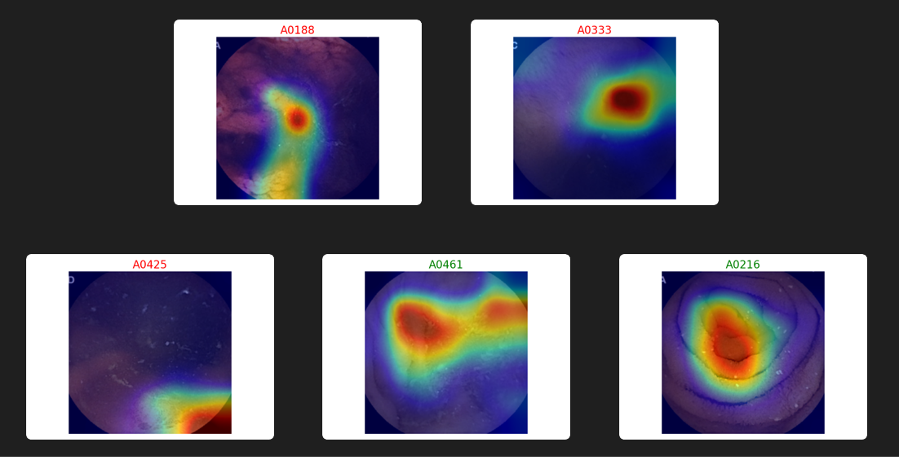

# WCEBleedGenChallenge
<b>Notes:</b>
- Our github code is made of two folders "Classification" and "Detection".
- All the model weight and plots for classification are saved in sub folder "outputs" in "Classification" folder.
- All the model weight and plots for detection are saved in sub folder "outputs" in Detection folder.

    
<b>1• A table of the achieved evaluation metrics of validation dataset</b>
   <b>Classification: Accuracy, Recall, F1-Score </b> 

               | Accuracy      | Recall        |  F1-Score  |
               | ------------- | ------------- | -----------|
               | Content Cell  | Content Cell  |            |
              
         
       

          
      

   
   <b>Detection: Average Precision, Mean-Average Precision, Intersection over Union(IoU))</b>
               | Accuracy Precision | Mean-Average Precision | Intersection over Union(IoU)|
               | -------------------| ---------------------- | ----------------------------|
               | Content Cell       | Content Cell           |                             |

     

          
      

         
<b>2• Screenshots/pictures of any 10 best images selected from validation dataset showing its classification and detection (bounding box with confidence level)</b>

      

          
      

    
<b>3• Screenshots/ pictures of achieved interpretability plot of any 10 best images selected from validation dataset</b>
         

          
         

  
<b>4• Screenshots/pictures of any 5 best images selected from testing dataset 1 and 2 separately showing its classification and detection (bounding box with confidence level)</b>    
         <b>Dataset 1</b>
               

                   
               

                 
           <b>Dataset 2</b>
               

                   
               

              
<b>5• Screenshots/ pictures of achieved interpretability plot of any 5 best images selected from testing dataset 1 and 2 separately</b>
            
         <b>Dataset 1</b>
               

                   
               

               
           <b>Dataset 2</b>
               

                   
               

             

<b>6. Excel Sheet Submission:</b>
