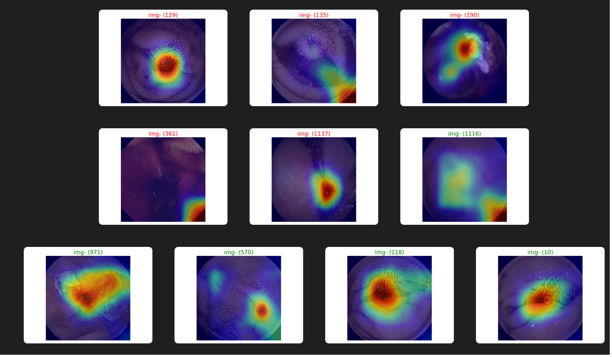

# WCEBleedGenChallenge
<b>Notes:</b>
- Our github code is composed of two folders "Classification" and "Detection" containing respectively the classification and detection codes.
- All the codes are written in python.
- All the model weight and plots for classification are saved in the sub folder "outputs" which is in the "Classification" folder.
- All the model weight and plots for detection are saved in the sub folder at "Detection\YOLO\yolov5\runs\train\exp" which is in the Detection folder of YOLO.
- The Excel sheet containing the image IDs and predicted class labels of testing dataset 1 and 2 is saved as <b>"Results.xlsx"</b> in the "Detection" folder.
- The datasets are in the folder "input" for the classification, and in the folder "data" (Detection\YOLO\data) for the detection.
- You used <b>split.py</b> script to split the training dataset into 80% for training set and 20% for validation set.

    
<b>1• A table of the achieved evaluation metrics of validation dataset</b>
   <b>Classification: Accuracy, Recall, F1-Score </b> 
   
               | Accuracy      | Recall        |  F1-Score  |
               | ------------- | ------------- | -----------|
               | Content Cell  | Content Cell  |            |
          
   
  
  

          
      

   
   <b>Detection: Average Precision, Mean-Average Precision, Intersection over Union(IoU))</b>
    
  
               | Accuracy Precision | Mean-Average Precision | Intersection over Union(IoU)|
               | -------------------| ---------------------- | ----------------------------|
               | Content Cell       | Content Cell           |                             |

   
  

          
      

         
<b>2• Screenshots/pictures of any 10 best images selected from validation dataset showing its classification and detection (bounding box with confidence level)</b>
  
    

          
      

    
<b>3• Screenshots/ pictures of achieved interpretability plot of any 10 best images selected from validation dataset</b>
  
         

          
         

  
<b>4• Screenshots/pictures of any 5 best images selected from testing dataset 1 and 2 separately showing its classification and detection (bounding box with confidence level)</b>    
         <b>Dataset 1</b>
               

                   
               

                 
           <b>Dataset 2</b>
               

                   
               

              
<b>5• Screenshots/ pictures of achieved interpretability plot of any 5 best images selected from testing dataset 1 and 2 separately</b>
            
         <b>Dataset 1</b>
               

                   
               

               
           <b>Dataset 2</b>
               

                   
               

             

<b>6. Excel Sheet Submission:</b>
